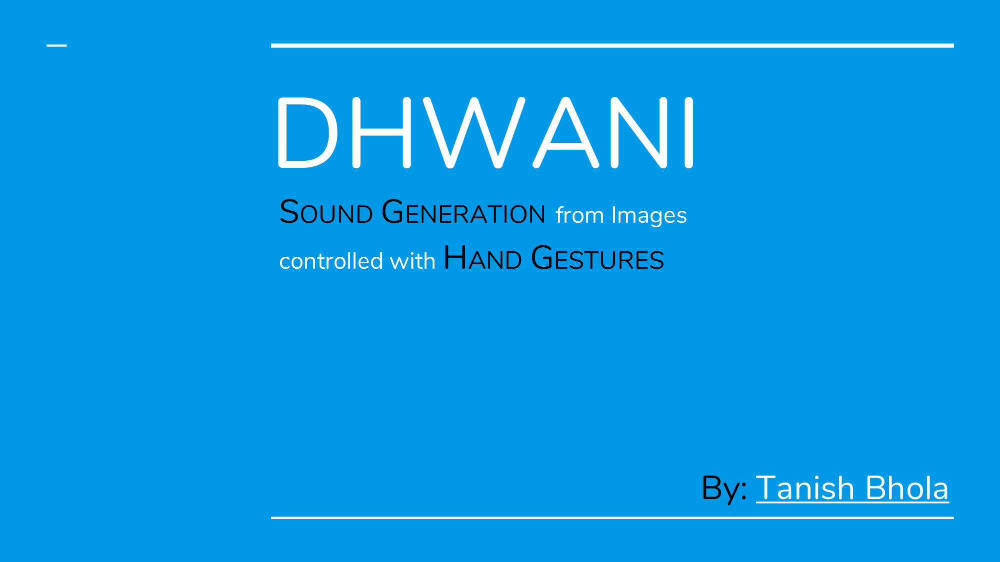

# Dhwani

Dhwani is a task concentrating on sound generation from a given picture utilizing the substance or foundation of the picture. Sound generation from pictures can have a lot of use, particularly in remembering the last minute or for investigating the spots without visiting them. With the utilization of waving hand motion, the client can open a picture and can tune in to the sound produced from each picture in turn. The utilization of waving hand motion for getting to the following or past picture has been fused into the task for improving user experience. There is a utilization of the folder connected to Google Drive on which the preparing has been performed. Thus, the client gets a bit of leeway of straightforwardly utilizing the pictures put away on the Google Cloud sparing time and hustle to move the pictures. Utilizing Deep Learning, Object Tracking and Computer Vision, dhwani is furnishing the clients with a remarkable development that comes packaged with elevated level client experience.

## WorkFlow

